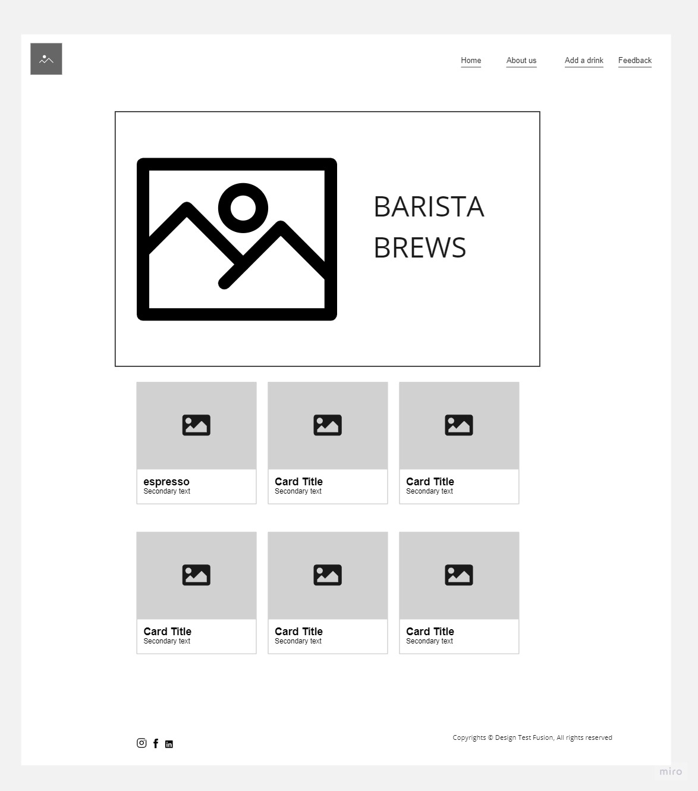
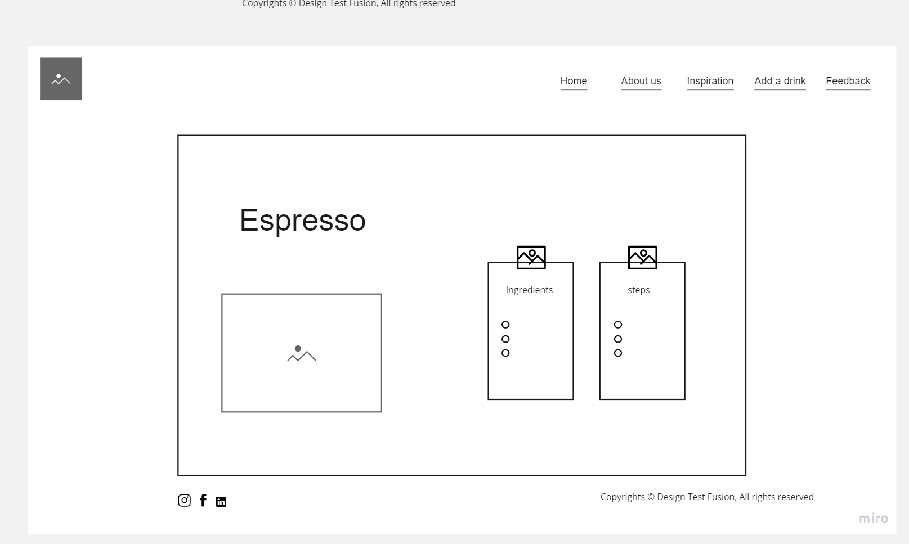
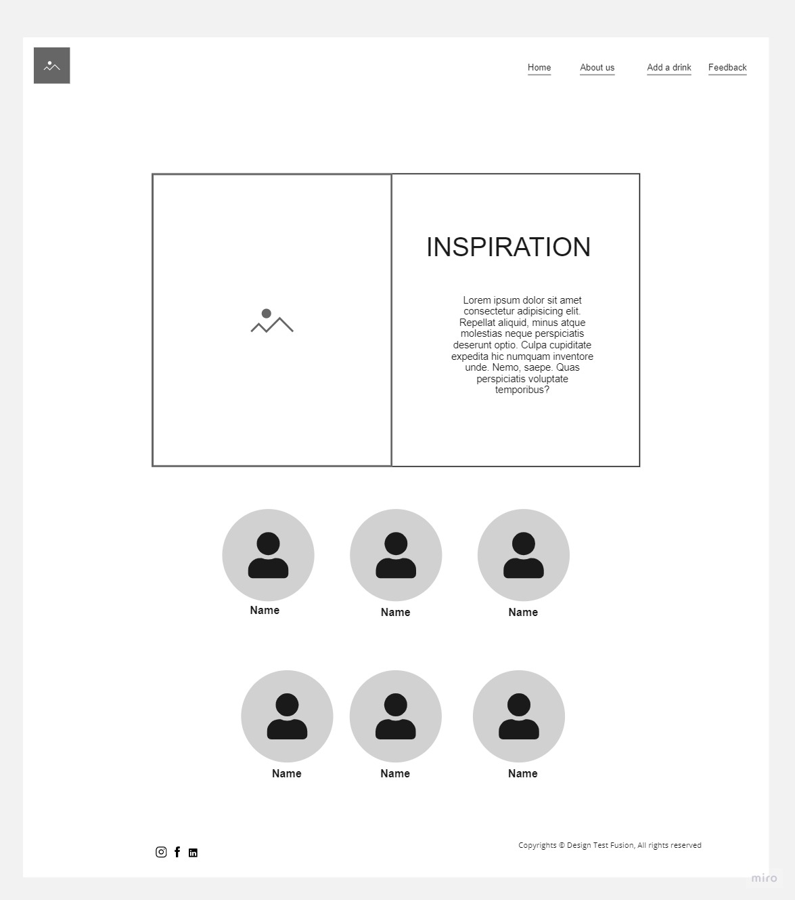
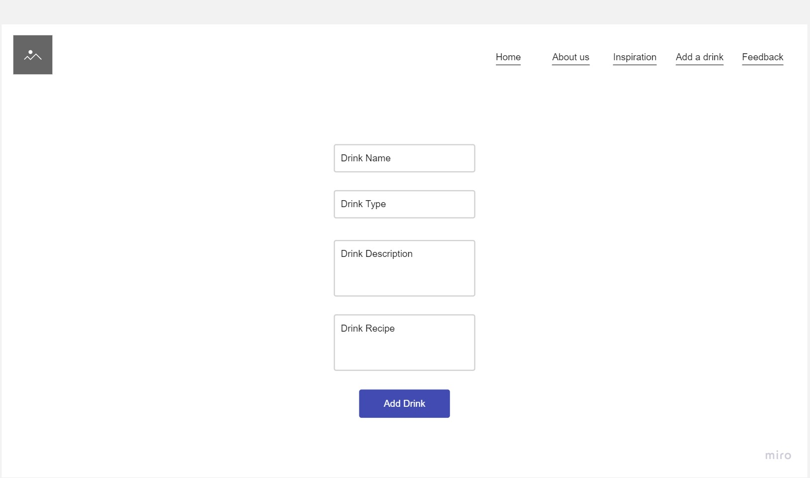
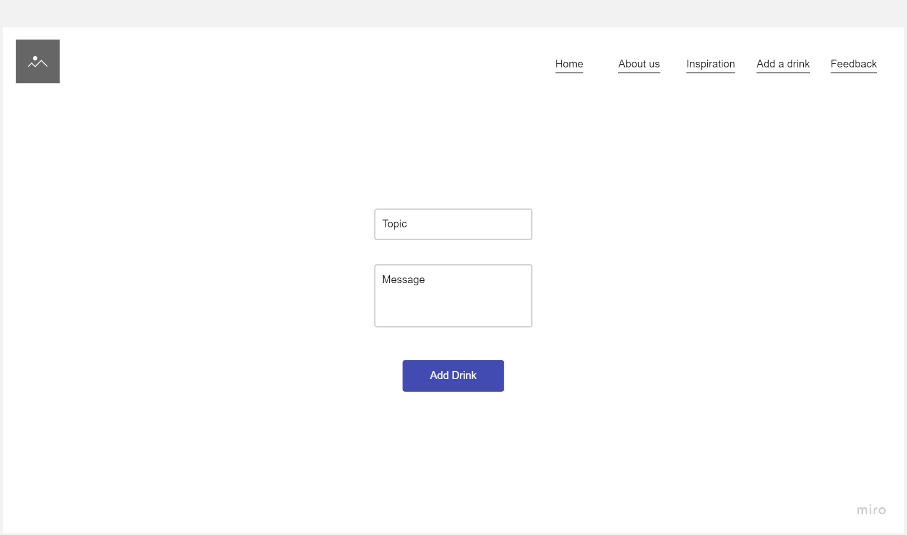
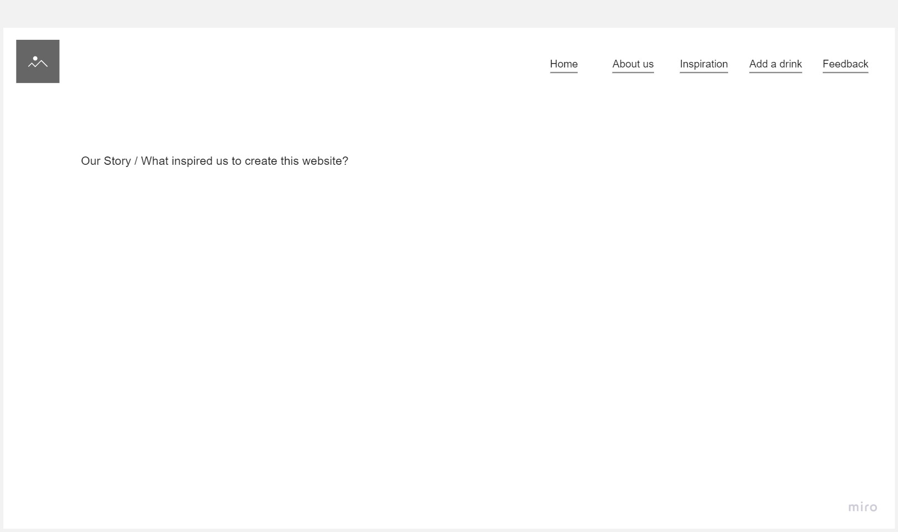

# Introduction

Project Name: Barista Brews

Project Team:

- Hussam Alraggad
- Wala Sbeitan
- Noor Yousef
- Anas Alnaser
- Anas Hamdallah
- Raneem Al-Sayyed Obeid

## About

Barista Brews is a website made for coffee lovers who want to make their favorite coffee drinks from the comfort of their home. This website provides the visitor a variety of coffee drinks for every mood and occasion.

## Problem and Solution

Problem:

The problem we are addressing is that coffee lovers rely on buying their favorite coffee drinks from coffee shops, which can be expensive or over-budget, and inconvenient. Many people would like to learn how to make their own coffee drinks at home, but they lack the knowledge and guidance to do so. They need resources where they can access a wide variety of coffee recipes and learn the step-by-step process of making their favorite drinks.

Solution:

Our solution is to build a coffee recipes website called "Barista Brews" that provides a comprehensive collection of coffee drink recipes. The website will offer a user-friendly interface where visitors can browse through a wide range of coffee recipes to choose between and fill their *coffee desires*.

## Getting Started

Simply clone the code to your local machine and run it in you desired editor. You will be navigated to a wonderful coffee theme interface which is the landing page (home page) where you can find a variety of coffee drinks for every mood and occasion.

## Built With

- HTML
- CSS
- JavaScript

## Wireframes

